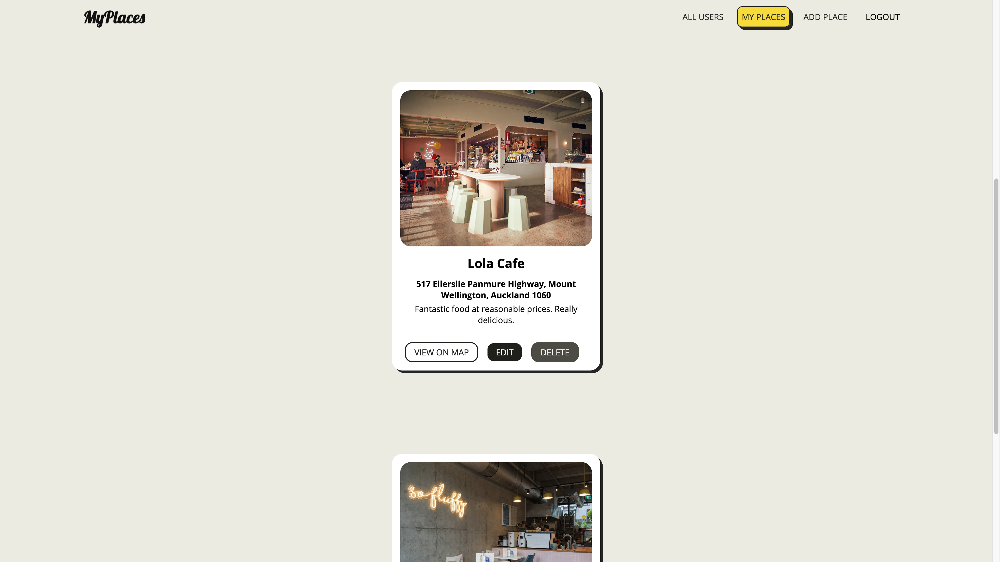
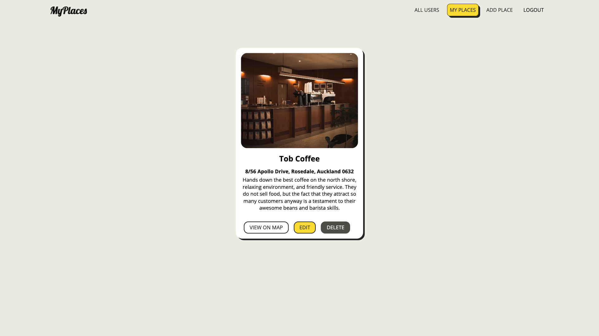
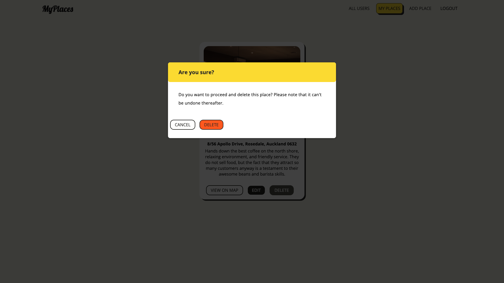

# MyPlaces - A Place Sharing Platform

## 📋 <a name="table">Table of Contents</a>

1. 🤖 [Introduction](#introduction)
2. 🔋 [Features](#features)
3. ⚙️ [Tech Stack](#tech-stack)
4. 🤸 [Quick Start](#quick-start)
5. 🕸️ [Snippets](#snippets)
6. 🔗 [Links](#links)
7. 📄 [License](#license)

## 🤖 Introduction

Welcome to MyPlaces! This web application allows users to create, share and explore their favourite places. Whether it's a hidden gem or a well-known spot, MyPlaces is the space to discover unique locations.

## 🔋 Features

👉  **User Account Creation and Login:** Sign up to create your account and log in to access your personal favourites, ensuring a secure and customized experience on MyPlaces.

👉  **Place Operations:** Add, update, and remove your favourite places.

👉 **Personal Reviews:**
Share your thoughts on your favourite places.

👉 **Image Upload Capability:**
  Share images to make your place listings more personal.

👉 **Responsive User Interface:**  Enjoy a smooth and dynamic experience when interacting with the platform.

👉  **Interactive Map Exploration:** Visualize place addresses on an interactive map for easy exploration.

## 🌐 Deployed Project

You can access the live demo of [My Places](https://mern-places-f385f.web.app/), where you can explore the features and functionalities of the application.

**Important Note:** The Node.js application is deployed on Render. It's important to note that [Render services](https://docs.render.com/disks) have an ephemeral filesystem. This means that any changes made to the service's local files will be lost whenever the service redeploys or restarts. Therefore, you may encounter missing images on certain pages due to this behavior.


## Website Walkthrough

### Step 1: Discover Users and Their Places
*Explore the My Places homepage to discover a comprehensive list of users.* 


*Click on each user to view their unique collection of places and reviews.*




*If a user does not have any places, a warning popup will notify you.*


### Step 2: User Authentication

*Sign up and log in to start sharing your favorite places and reviews with the community.*


*If there are no existing users, a warning popup will inform you.*


### Step 3: Add New Place with Validation
*After logging in, users can add a new place to the platform. The form includes validation checks to ensure that all inputs are valid.*


### Step 4: Update Place Information

*Users are enabled to update the information of a place by clicking the edit button on the place card. This functionality allows users to modify and improve the details of their listed places as needed.*




### Step 5: Easy Place Deletion with Confirmation
*Users can delete their places by clicking the delete button on a place card.*


*A warning popup will appear to confirm the deletion.*




### Step 6: Explore Places on the Interactive Map
*Click the map button on a place card to view its address on the interactive map interface.*


### Step 7: Log Out from My Places
*Click the logout button at the top right corner to log out from your My Places account.*


## ⚙️ Tech Stack

- **Frontend**: React
- **Backend**: Node.js, Express.js
- **Database**: MongoDB


## 🤸 Quick Start

Follow these steps to set up the project locally on your machine.

### Prerequisites

Make sure you have the following installed on your machine:

- [Git](https://git-scm.com/)
- [Node.js](https://nodejs.org/en)
- [npm](https://www.npmjs.com/) (Node Package Manager)

### Cloning the Repository

**Backend**

```bash
git clone https://github.com/TaiJoLo/mern-backend.git
cd mern-backend
npm install
```

**Frontend**

```bash
git clone https://github.com/TaiJoLo/mern.git
cd mern
npm install
```

### Running the Project
**1. Start the backend server**
```bash
cd mern-backend
npm run dev
```

**2. Start the frontend application**
```bash
cd mern
npm run start
```

Open http://localhost:3000 in your browser to view the project.


## 🤝 Contributing

We welcome contributions to Crown Clothing! If you'd like to contribute, please fork the repository, create a feature branch, and submit your pull request for review.

## 📄 License

This project is licensed under the MIT License - see the [LICENSE](https://github.com/TaiJoLo/crwn-clothing/blob/Redux/LICENSE) file for details.
